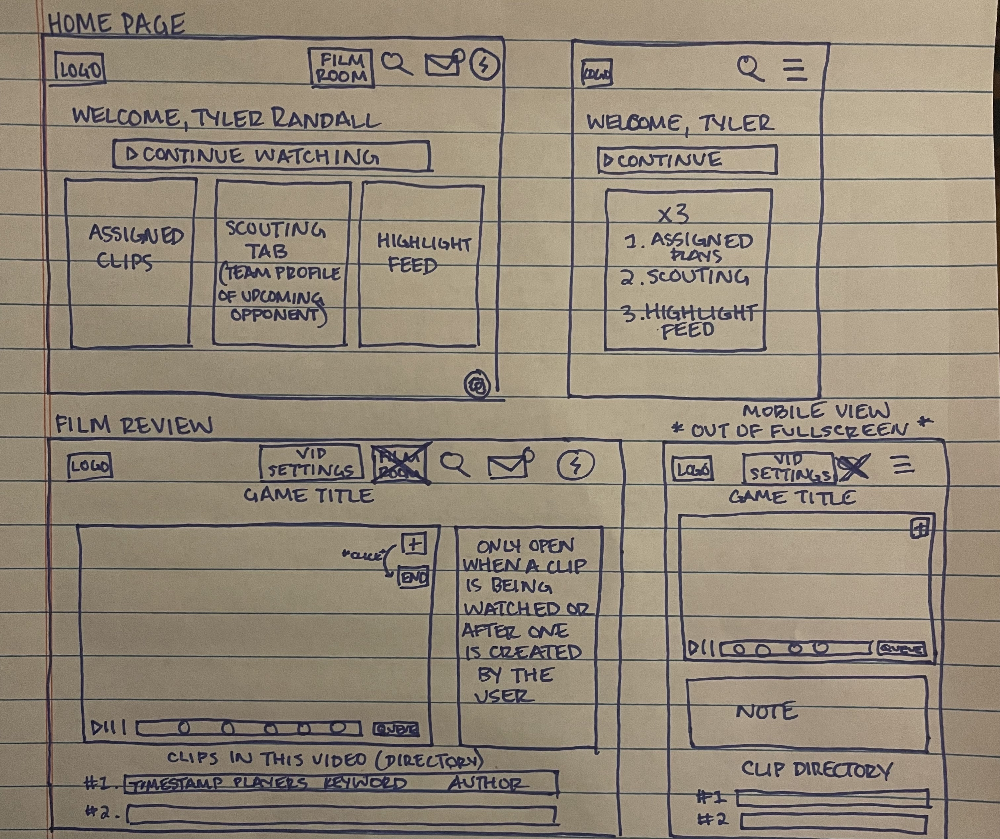
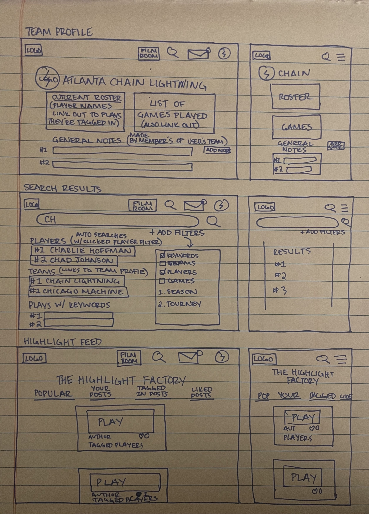
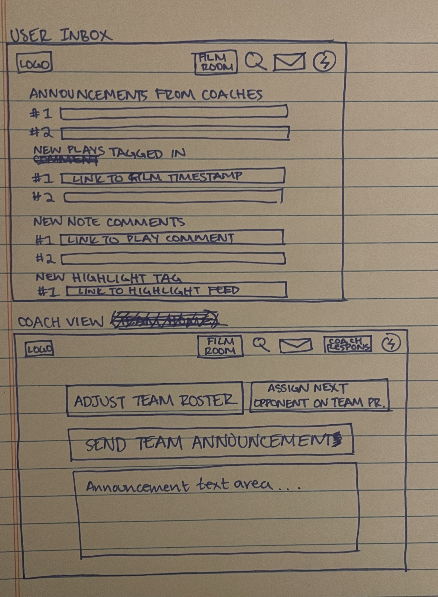

Overview
    - This app gives players and teams an environment where they can seamlessly review and breakdown film from games / practices all in one place. It can be used for both internal development and for detailed scouting on future opponents.

Features:
1. Team Specific Accounts
    - User notes with this team affiliation are all put in one place.
    - This means scouting can be done without worrying about another team user seeing it.
2. User Roles
    - Users who are verified with a team and can post to that team's account
    - Users who are not verified with a team and will only be posting on their personal account
3. Watch Games in App
    - In a perfect world, the video is playing in the same browser as the app is running.
    - However, due to cose we might have to use external browser like youtube to run videos.
        - If this is the case then make it easy to link film clip with timestamp of video
4. Create Film Clips
    - While watching a video, user is able to clip part of a video and make a note about what happens
    - If this user is verified with a team, when another team member is watching the same video they will be able to see the note.
    - It is possible for a user to tag people and keywords. When a user is tagged they will be notified. Keywords can be searched for in the search field. 
    - Global keywords (like team names, season and tournament) will be automatically added to all subsequent clips that are made in that game.
    - After the initial clipping takes place the user is able to manipulate the start and stop timestamps if they messed up.
5. Quality of Life Features for Film Review Page
    - You are able to change settings when watching back a game. You can turn off comments completely. You can also filter to only show notes made by a certain author, only show notes with certain keywords or notes that you're tagged in.
    - Clips are recorded as a duration, not a single time stamp. 
    - If multiple clips span the same time. A queue will be formed. This will allow the user to decide if they want to watch that clip again or just move on without too much worry.
    - Queued clips can be clicked or deleted.
    - If you are stil commenting on a previous clip when another clip comes up, it will be queued as well. To not disturb the current draft.
    - After a clip's duration is over a user can easily click replay or make a comment on the note that will send to the original author.
6. Allow Highlights to be Shared
    - Plays that are deemed highlights while watching can easily be shared
    - User has the option to include notes along with clip or if they only want to share the clip
    - This could be turned into a mini social media feed as well. For example as a user is clipping a chunk of film they can decide if they want to post it on their feed. (Notes will be not be viewable on highlight feed)
7. Everything is Searchable
    - Users can search by season, team, game, tournament, keywords, and players
    - Team and Player results allow you to go to a respective profile
8. Mobile/Fullscreen Film Review Quality of Life
    - When a note comes up while watching a video instead of stopping the video right away an icon appears in the bottom right of the video. It says 'open note'
    - The open note button will stop the video and exit out of fullscreen so that the note will now populate below the video player.

Rough Design (2nd Drafts!)

