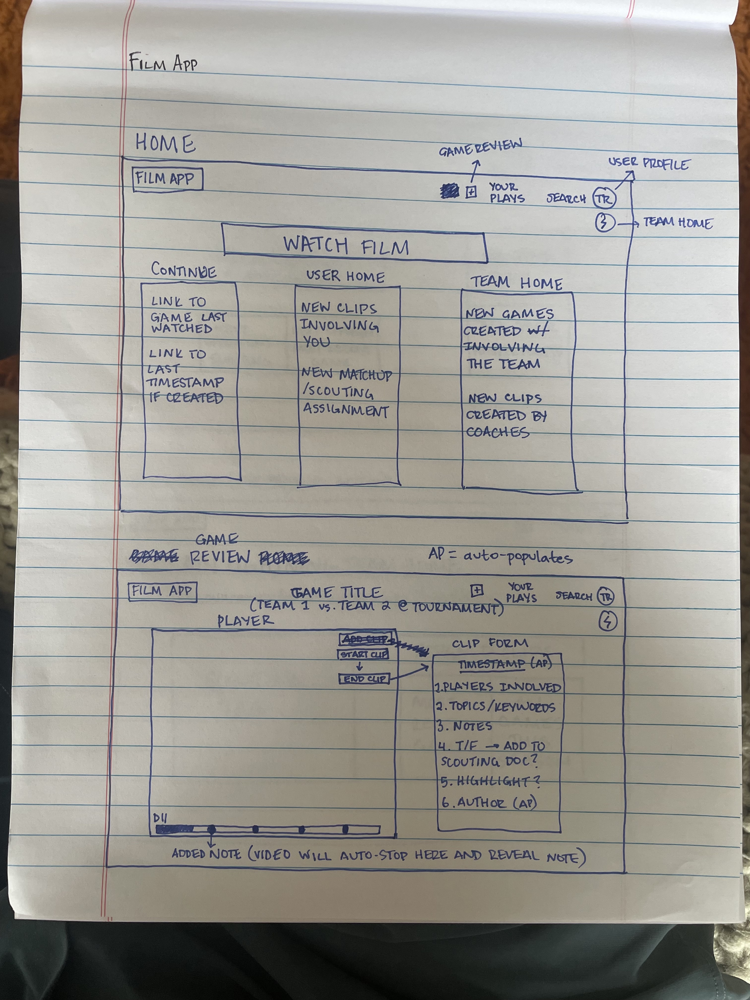
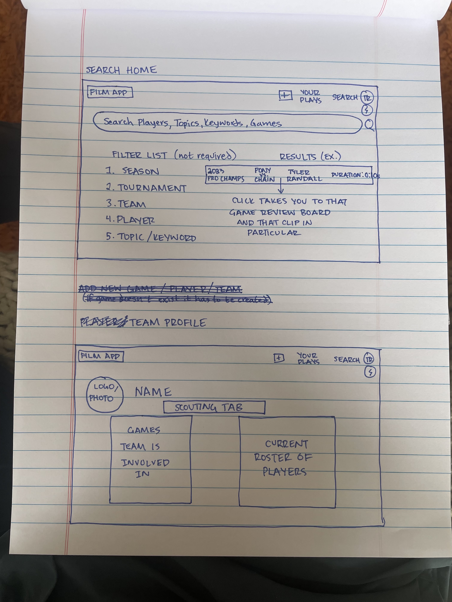
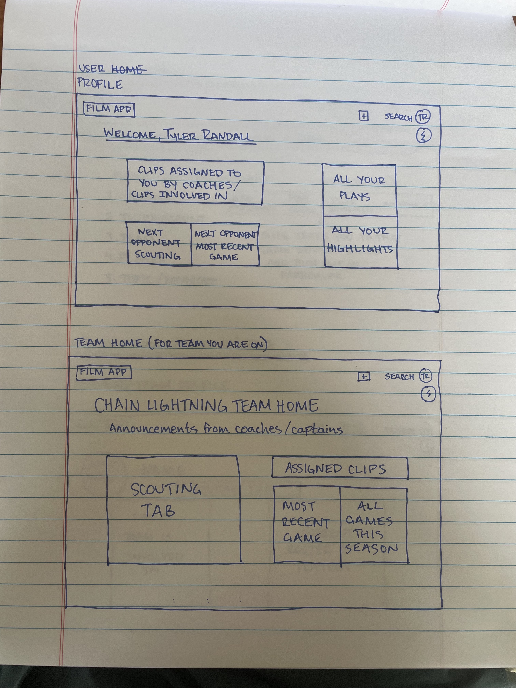

Overview
    - This app gives players and teams an environment where they can seamlessly review and breakdown film from games / practices all in one place. It can be used for both internal development and for detailed scouting on future opponents.

Features:
1. Team Specific Accounts
    - User notes with this team affiliation are all put in one place.
    - This means scouting can be done without worrying about another team user seeing it.
2. User Roles
    - Users who are verified with a team and can post to that team's account
    - Users who are not verified with a team and will only be posting on their personal account
3. Watch Games in App
    - In a perfect world, the video is playing in the same browser as the app is running.
    - However, due to cose we might have to use external browser like youtube to run videos.
        - If this is the case then make it easy to link film clip with timestamp of video
4. Create Film Clips
    - While watching a video, user is able to clip part of a video and make a note about what happens
    - If this user is verified with a team, when another team member is watching the same video they will be able to see the note.
    - Film clips are kept in a team-wide / user-wide database that can be searched / sorted by keywords (ie. players involved, topic discussed (ie. deep defense), teams, etc...)
5. Allow Highlights to be Shared
    - Plays that are deemed highlights while watching can easily be shared
    - User has the option to include notes along with clip or if they only want to share the clip

Rough Design

